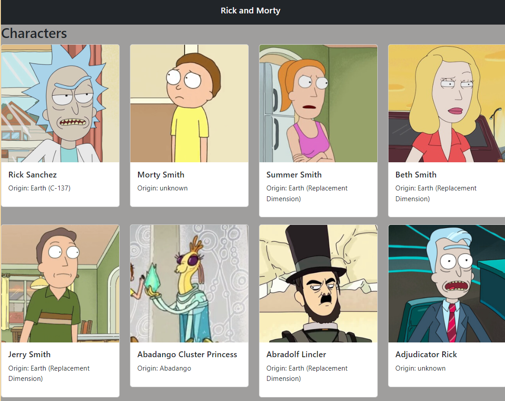

# Creating a Single Page Application

## Description
Created a single-page application in React that retrieves data from an API and runs in the browser with Webpack and Babel. Styling was done using Bootstrap. The application  showed information about the popular TV show Rick and Morty, along with images.

### Requirements
- Node
- Npm
- Webpack
- Babel

### Screenshot

### Getting Started
Clone the repository to get started.